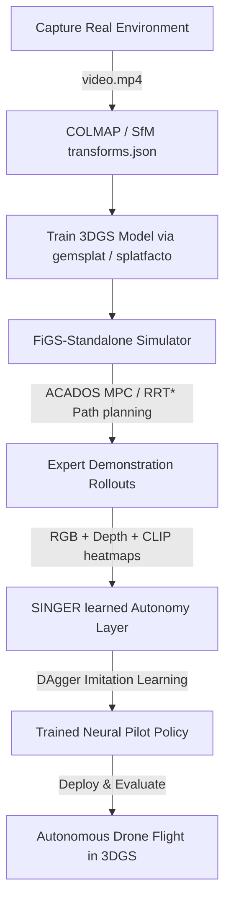

# V-LEAD: Drone Autonomy in 3D Gaussian Splats

V-LEAD is a quadcopter autonomy research framework integrating physics-accurate drone simulation with learned visuomotor policies trained inside photorealistic **3D Gaussian Splatting (3DGS)** environments.

**CS224R work (current):** flow-matching BC policy → SAC fine-tuning in FiGS. See [`nav_policy/DATA_SETUP.md`](nav_policy/DATA_SETUP.md) for the end-to-end training guide.

---

## 🗺️ Framework Overview

V-LEAD is composed of two primary sub-systems (integrated via Git submodules) and structured operator guides:



### Core Components:
1. **[FiGS-Standalone](FiGS-Standalone)** (*Flight in Gaussian Splats*): Physics-accurate quadcopter simulator in 3DGS environments. Handles rigid-body dynamics (ACADOS), MPC expert controllers, RRT* planning, and multi-channel rendering (RGB, depth, CLIP).
2. **[SINGER](SINGER)** (*Scene Understanding via Synthesized Visual Inertial Data from Experts*): DAgger imitation learning pipeline producing trained neural pilots (HistoryEncoder + VisionMLP + CommanderSV).
3. **[nav_policy](nav_policy/)** *(CS224R addition)*: RGB-only visuomotor policy (ResNet-18 + GRU) trained via flow matching (OT-CFM) as a BC seed for SAC RL fine-tuning. Trains on Modal cloud GPUs; no local GPU required.

---

## 📚 Operator Guides & Documentation

To get started, reference these comprehensive guides included in this repository:

| Guide / Reference | Purpose | Target Audience |
| :--- | :--- | :--- |
| 🚀 **[nav_policy/DATA_SETUP.md](nav_policy/DATA_SETUP.md)** | **Start here for CS224R.** Download data → build dataset → train FM policy on Modal. | Anyone running FM/RL training |
| 📖 **[V-LEAD_instructions.md](V-LEAD_instructions.md)** | Full pipeline operator guide: containers, data generation, gotchas. | Users & Policy Researchers |
| 🎮 **[FiGS_instructions.md](FiGS_instructions.md)** | Simulator operator guide: 3DGS training, perception modes, ACADOS control. | Simulator Operators |
| 🧠 **[AGENT_CONTEXT.md](AGENT_CONTEXT.md)** | Architectural blueprints, codebase maps, directories, gotchas. | AI Agents & Developers |

---

## 📁 Repository Structure

```
V-LEAD/
├── FiGS-Standalone/       # Submodule: Simulator, MPC Control, & 3DGS Rendering
├── SINGER/                # Submodule: DAgger training pipeline & Imitation Policies
├── nav_policy/            # CS224R: FM + SAC policy (train on Modal, no local GPU)
│   ├── DATA_SETUP.md      #   ← start here
│   ├── configs/           #   training configs (BC, FM, ablations, SAC)
│   ├── modal_train.py     #   Modal cloud training entrypoints
│   └── src/nav_policy/    #   model, data, train, RL packages
├── vlead/                 # Gymnasium env wrapper (FigsDroneEnv) + VLeadPilot
├── AGENT_CONTEXT.md       # Architectural reference for developers
├── CLAUDE.md              # Claude Code guidance
├── V-LEAD_instructions.md # Operator guide
└── FiGS_instructions.md   # Simulator reference
```

---

## ⚡ Quick Start Reference

### 1. Run the Drone Simulator
To enter the simulator environment and run a flight demo:
```bash
cd FiGS-Standalone
docker compose -f docker-compose.base.yml run --rm figs
# Inside the container:
python3 notebooks/figs_simulate_flight_example.py
```
*Creates a simulated flight recording at `test_space/track_spiral_flightroom_ssv_exp.mp4`.*

### 2. Run SINGER Policy Training
To enter the training container and run the full neural pilot pipeline:
```bash
cd SINGER
docker compose run --rm singer
# Inside the container:
# Step 1: Generate expert rollouts
python3 notebooks/ssv_multi3dgs_campaign.py generate-rollouts --config-file configs/experiment/smoke_test.yml
# Step 2: Train history encoder
python3 notebooks/ssv_multi3dgs_campaign.py train-history --config-file configs/experiment/smoke_test.yml
# Step 3: Train policy commander
python3 notebooks/ssv_multi3dgs_campaign.py train-command --config-file configs/experiment/smoke_test.yml
```

---

