# V-LEAD — Vision-Only Quadrotor Navigation in 3D Gaussian Splats

Goal-conditioned quadrotor navigation from **monocular RGB** — no map, no depth sensor,
and no full state estimate. A privileged MPC expert flies photorealistic 3D Gaussian
Splatting reconstructions of a real flight room; a compact vision policy is distilled
from it by behavior cloning, corrected by DAgger with an MPC re-solve oracle, and then
improved past the demonstrator with online reinforcement learning.

The policy maps a 4-frame RGB history plus a 3-D goal vector to a 10-step horizon of
velocity commands at 20 Hz. Depth comes from a *frozen* Depth Anything V2 branch rather
than a sensor, so the deployed sensing stays RGB-only. The only non-visual input is the
goal vector — a unit heading and a normalized distance, which is all the localization the
policy gets.

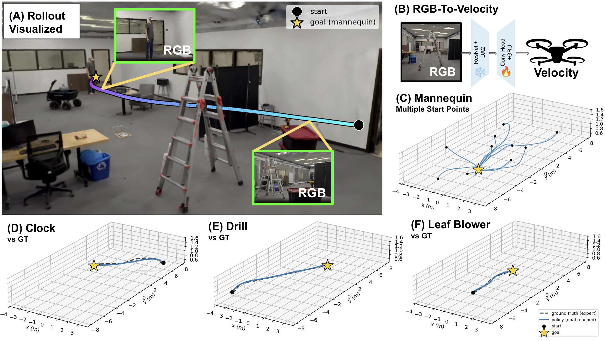

*(A)* A rollout to a mannequin goal, with the onboard RGB the policy actually consumed.
*(B)* The RGB-to-velocity policy: frozen ResNet-18 + DA2 encoders, trainable conv head and
GRU. *(C)* The same goal reached from many different start points. *(D–F)* Policy (solid)
against the privileged expert (dashed) for clock, drill, and leaf-blower goals.

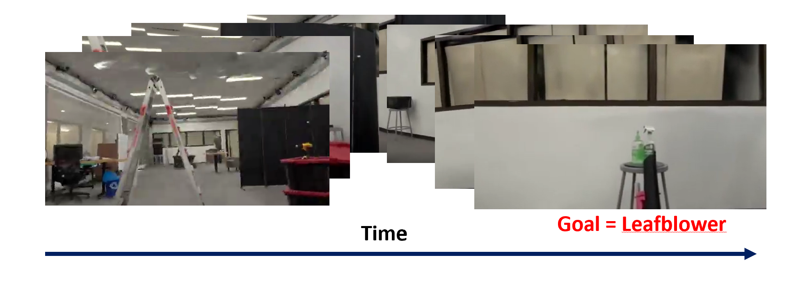

*The observation stream over one rollout — this, plus three numbers, is the entire input.*

---

## Why RGB only

- **Weight and power.** LiDAR, active depth, and motion-capture rigs are heavy,
  power-hungry, or confined to instrumented rooms. A single forward-facing camera is not.
- **Pretrained priors.** RGB lets the policy inherit ImageNet and depth-foundation
  representations instead of learning perception from scratch, which makes a small corpus
  of flight demonstrations go much further.
- **Map-free, GPS-denied operation.** Indoors and in clutter, SLAM and state estimation
  are brittle and expensive. End-to-end image-to-action replaces the mapping,
  localization, planning, and control stack with one learned policy.

---

## Results

Two evaluation protocols, measuring different things. Both matter, and they are reported
separately because they are **not comparable**.

### 1. In-distribution goal objects

Closed-loop rollouts in the flightroom validation suite, grouped by target object. These
goal objects appear in the training data, so this measures competence, not generalization.
Success requires the settle detector to fire within the time cap — position **and** yaw
tolerance plus consecutive low-velocity steps.

| Stage | Green clock (N=30) | Drill (N=29) | Mannequin (N=28) | Collision rate |
|---|---|---|---|---|
| BC, ResNet-only | 20% | 52% | 14% | 33% |
| \+ DA2 depth fusion | 83% | 79% | 71% | 11% |
| \+ DAgger (2 rounds, MPC oracle) | **97%** | 79% | 71% | 9% |
| \+ SAC fine-tuning | **97%** | **90%** | **75%** | **5%** |

Each stage fixes a distinct failure mode: depth fusion supplies the geometry RGB alone
does not carry (collisions drop 33% → 11%), DAgger teaches recovery from
self-induced states, and SAC refines terminal deceleration and yaw alignment where
supervised imitation plateaus.

Aggregate tracking on the same suite:

| Stage | Pos. RMSE (m) | Vel. RMSE (m/s) | Yaw RMSE (rad) |
|---|---|---|---|
| BC, ResNet-only | 1.78 | 0.54 | 1.45 |
| \+ DA2 depth fusion | 1.56 | 0.65 | 0.65 |
| \+ DAgger | 1.57 | 0.64 | **0.58** |
| \+ SAC | **1.56** | 0.62 | 0.61 |

> Tracking RMSE against the expert is a diagnostic, not the objective. The objective is
> reaching the goal without collision, and a policy can legitimately deviate from the
> expert path while doing so better.

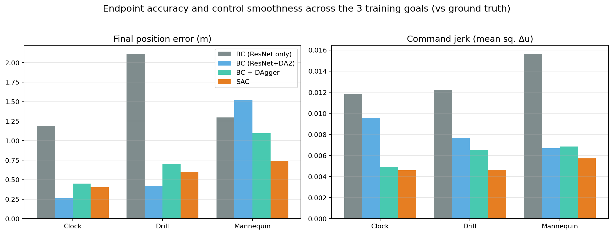

Command jerk drops sharply once depth is fused and keeps declining through SAC, which
ends lowest on all three goals — roughly 2.5× smoother than ResNet-only BC. That matters
for hardware plausibility, not just for the metric.

Endpoint error is *not* monotone, and it is worth being clear about that: DA2 fusion
actually worsens final position error on the mannequin (1.30 m → 1.52 m) before DAgger
and SAC pull it down to 0.74 m, and DAgger costs a little endpoint accuracy on the clock
and drill while buying a large success-rate gain. Success rate and collision rate are the
objectives here; endpoint error against the expert path is a diagnostic that can move the
other way.

### 2. Unseen goal object (cross-object generalization)

The `full-110` suite holds out an entire *goal object* — the ladder — which never appears
in training. RL fine-tuning was done on the clock and drill, so this is a generalization
and non-regression check rather than a same-goal improvement measure.

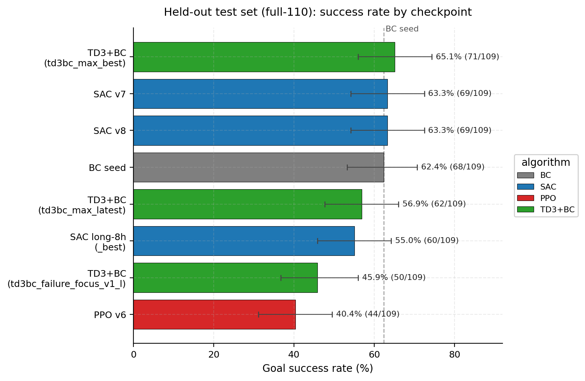

| Checkpoint | Success (n=109) | Timeout | Collision |
|---|---|---|---|
| **Residual TD3+BC** | **65.1%** | 28.4% | 7.3% |
| SAC v7 / v8 | 63.3% | 33.9% / 32.1% | 5.5% / 4.6% |
| BC + DAgger seed | 62.4% | 31.2% | 6.4% |
| SAC (long 8 h run) | 55.0% | 40.4% | 4.6% |
| PPO v6 | 40.4% | 53.2% | 10.1% |

**The honest read.** On an unseen goal object, residual TD3+BC is the only method that
clears the BC seed (+2.7 pts, with timeouts down 31.2% → 28.4%). Vanilla SAC roughly
holds. On-policy PPO *regresses badly* here. A cross-checkpoint query analysis explains
why RL cannot do much better on this suite: across five checkpoints, RL cracked **1** new
query the seed failed while breaking **25** the seed had passed, and **41** queries were
never solved by any checkpoint. That ceiling is a property of the approach, not of the
tuning.

The seed's own failures are near-misses: of 42, **34 are timeouts** with median final
position error 0.94 m and none reaching the goal. The drone gets ~90% of the way and
cannot settle inside the 0.5 m radius in time.

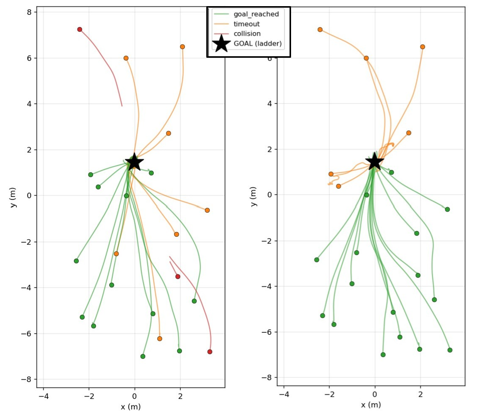

*BC + DAgger seed (left) vs PPO (right) on a **subset** of ladder spawns. Green reaches
the goal, orange times out, red collides. On this subset PPO removes the seed's
collisions entirely and fails only by timeout, and spawns south of the goal succeed
almost always while northern ones do not.*

That figure is worth reading carefully, because it is where a much rosier PPO number
comes from. Scored on **this spawn subset** PPO looks strong; scored on the **full 110-query
suite** it lands at 40.4% with a *higher* collision rate than the seed (10.1% vs 6.4%).
Both measurements are real — they are just not the same measurement, and only the second
one is a held-out suite of fixed composition. The table above uses the full suite
throughout for exactly that reason.

Yaw alignment, not obstacle avoidance, is the dominant remaining failure mode. Mining the
seed's failures on the training pool puts **56% on yaw alone** and 68% involving yaw,
against only 4% collisions:

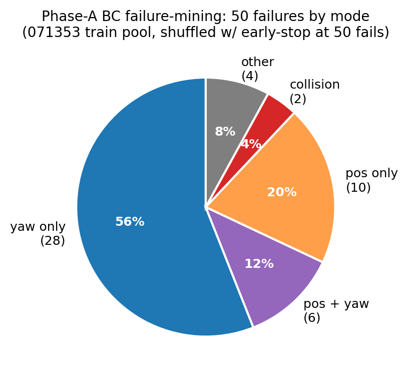

### Why residual TD3+BC over vanilla SAC

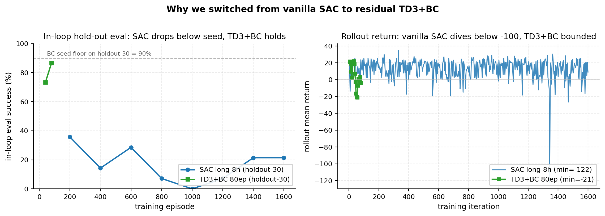

Fine-tuning a carefully built BC seed with off-policy RL destroys it by default: a
randomly initialized critic emits meaningless values, and a high-capacity vision actor
that follows them overwrites the pretrained features. Four stabilizers were needed:

- **Frozen base + residual head.** The visual encoders, fusion block, GRU, and head are
  frozen; only a zero-initialized residual head and critic train, so the policy *starts
  exactly at* the BC seed: `μ(s) = μ_BC(s) + ρ·tanh(g_θ(z(s)))`.
- **Critic warmup.** Q-networks update alone for an initial phase, so the actor never
  chases an untrained value function.
- **BC anchor.** An MSE penalty toward a frozen copy of the seed, serving the role a KL
  trust region plays in on-policy methods.
- **Eval-floor gate.** In-loop held-out eval selects the checkpoint. This mattered: the
  final-episode checkpoint drifted ~8 pts below the gated best.

Without these, the long SAC run collapsed — rollout return dove below −100 and held-out
success fell from 62% to under 5% before recovering only partway.

---

## What the policy learned

### Where it looks

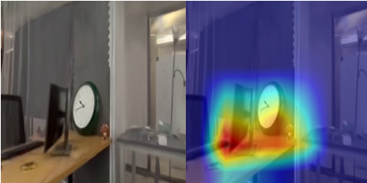

Grad-CAM on ResNet `layer4` for a green-clock approach. Saliency concentrates on the goal
object **and** on the desk/monitor edge beside it — the policy attends to the target and
the nearest obstacle simultaneously, rather than keying on scene-level appearance.

### What breaks it

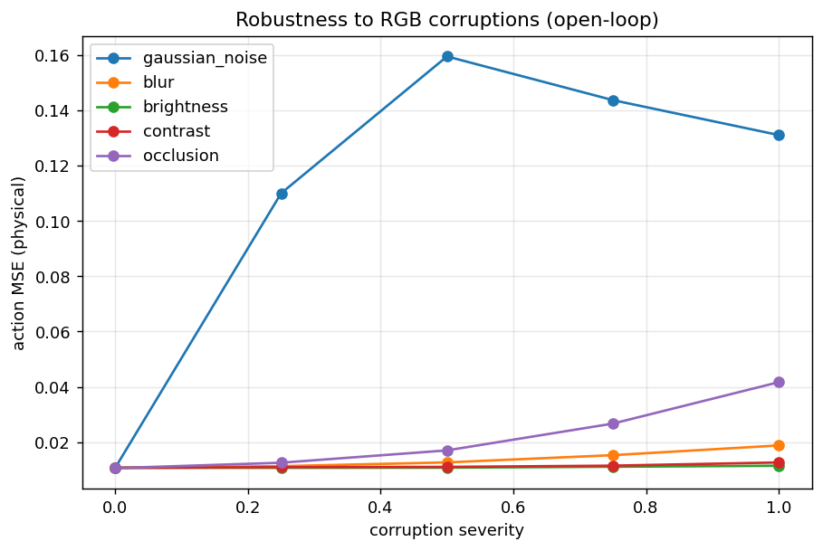

Open-loop action error against corruption severity. One failure mode dominates: additive
Gaussian noise drives error from a clean baseline of 0.011 to a peak of 0.16 (~14×), and
occlusion reaches 0.042. Photometric shifts — blur, brightness, contrast — barely
register, topping out at 0.019. That profile is consistent with a representation relying
on fine spatial structure and object silhouettes while staying largely invariant to global
appearance, which is what the photometric augmentation during training was meant to buy.
It also says where to spend effort next: sensor-noise augmentation, not more color jitter.

---

## Reproducing every figure

All logs are committed. No lab access, no checkpoints, no NFS mounts needed:

```bash
cd nav_policy/scripts/plots
pip install -r requirements.txt
bash regenerate.sh
```

Each of the 7 figures regenerates into `results/` from the ~90 committed
`summary.json` / `per_rollout.csv` / TensorBoard files under `results/logs/`.
[TEST_RESULTS.md](TEST_RESULTS.md) is the source-of-truth index: one row per
(checkpoint, eval suite) with n, success, CI95, timeout and collision rates.

---

## Method

**Task.** An episodic POMDP over a Gaussian-splat scene. Observation is 4 recent
224×224 RGB frames, frozen-DA2 depth, and `g_t = (h_x, h_y, d̃)` — unit XY heading to the
goal plus distance normalized by a fixed 5 m scale. Action is a 10-step chunk of
`[vx, vy, vz, ψ̇]`; only the first step executes before re-planning. Episodes end on
settle, collision, workspace exit, or timeout.

The goal vector is what makes mapless goal-seeking possible: an image sequence encodes
neither *where to go* nor *how far is left*. The heading supplies direction, and the
normalized distance supplies a deceleration signal — both computable from the drone's
state and the mission objective, with no map.

**Network.**

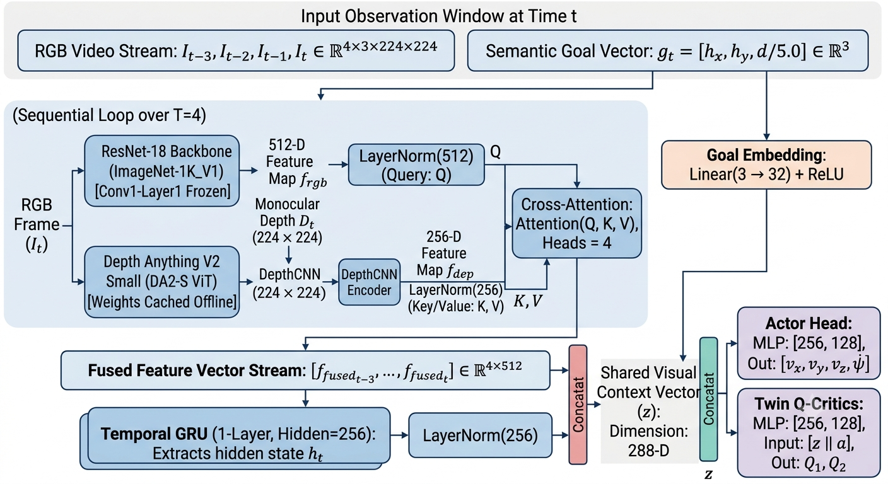

Each of the 4 frames is encoded independently by ResNet-18 (ImageNet init, stem and
`layer1` frozen) into 512-D, while a frozen DA2-S branch produces a monocular depth map
that a small strided CNN encodes to 256-D. Both are LayerNormed and fused by 4-head
cross-attention with RGB as the query. A 1-layer GRU (hidden 256) pools the sequence into
a visual context, which concatenates with a 32-D goal embedding to give the 288-D vector
feeding the actor head — and, during RL, the twin Q-critics. The base is frozen entirely
during RL fine-tuning; only the residual head and critics train.

**Training and deployment.**

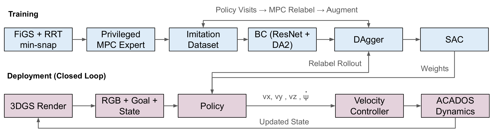

| Stage | What it does |
|---|---|
| Expert data | Privileged body-rate MPC tracks RRT\*/min-snap references through 3DGS scenes, logging synchronized RGB and state/control at 20 Hz |
| Behavior cloning | Chunked-action MSE + temporal-smoothness regularizer (λ=0.05); AdamW, lr 6e-4, 130k training windows from 440 trajectories |
| DAgger ×2 | Roll out the policy, re-solve the MPC oracle at every visited state, fine-tune with balanced 50/50 expert/policy sampling |
| RL fine-tuning | PPO, SAC, and residual TD3+BC warm-started from the DAgger seed; dense progress + heading + smoothness rewards, bbox and collision penalties, terminal settle bonus |

Full interface and hyperparameter tables are in [ARCHITECTURE.md](ARCHITECTURE.md).

---

## Repository layout

| Path | Contents |
|---|---|
| [`nav_policy/`](nav_policy) | Policy, dataset builder, BC / DAgger / RL trainers, evaluators |
| [`nav_policy/src/nav_policy/rl/`](nav_policy/src/nav_policy/rl) | PPO, SAC, residual TD3+BC, rollout collection, reward shaping, eval queue |
| [`vlead/`](vlead) | `vlead_flight` — deployment pilot, recorder, Gym-style FiGS environment |
| [`results/`](results) | RL figures + committed run logs (self-contained, reproducible) |
| [`docs/figures/`](docs/figures) | Write-up figures (architecture, saliency, robustness, trajectories) |
| [`FiGS-Standalone/`](FiGS-Standalone) | Submodule — simulator, MPC, 3DGS rendering |
| [`SINGER/`](SINGER) | Submodule — expert rollout campaigns |

Docs: [ARCHITECTURE.md](ARCHITECTURE.md) · [TEST_RESULTS.md](TEST_RESULTS.md) ·
[V-LEAD_instructions.md](V-LEAD_instructions.md) ·
[FiGS_instructions.md](FiGS_instructions.md) ·
[nav_policy/README.md](nav_policy/README.md)

---

## Getting started

Requires a Linux host with an NVIDIA GPU, Docker, and a trained 3DGS scene. The 3DGS
scene assets are not redistributable — see
[FiGS_instructions.md](FiGS_instructions.md) for training your own from video.

```bash
git clone --recursive https://github.com/kothari1/V-LEAD.git
cd V-LEAD

# one-time: build the simulator image
cd FiGS-Standalone && docker compose build && cd ..

# enter the dev container (all packages editable-installed on first entry)
DATA_PATH=/path/to/your/data docker compose run --rm vlead
```

Then, inside the container:

```bash
cd /workspace/nav_policy

# build the dataset from expert rollouts, precompute depth
python scripts/build_dataset_flightroom.py --config configs/flightroom.yaml
python scripts/precompute_da2_depth.py --processed-root data/processed_flightroom

# behavior cloning
python scripts/train_bc.py --config configs/arch_rgb_da2_crossattn.yaml

# DAgger round 1
python scripts/run_dagger.py --config configs/dagger_round1_mpc.yaml

# RL fine-tuning
python scripts/train_rl.py --config configs/train_rl_flightroom_td3bc_dagger_r12.yaml

# closed-loop evaluation
python scripts/eval_in_figs.py --config configs/eval_closed_loop_flightroom_suite.yaml
```

See [nav_policy/README.md](nav_policy/README.md) for the complete pipeline including
cloud training on Modal.

---

## Limitations

Stated plainly, because they bound what these numbers mean:

- **Single scene.** All results are in one reconstructed flight room. Cross-environment
  transfer is untested, and the one cross-environment checkpoint evaluated here scored
  2.8%.
- **Privileged supervision.** DAgger needs a queryable MPC oracle, which not every
  simulator can provide.
- **Hand-shaped rewards.** RL performance is sensitive to reward weights and scales that
  were tuned by hand. An early imbalance made the cost of not reaching the goal exceed the
  cost of colliding, and the policy learned to crash on purpose.
- **Render-bound.** Every control step triggers a fresh 3DGS render, capping affordable
  RL episodes and eval trials.
- **Simulation only.** No hardware deployment. That would additionally need domain
  randomization, on-hardware DAgger, and latency-aware controller tuning.

---

## Contributions

A team project. All members contributed to design, experiments, and write-up, with
overlapping work.

**My contributions** — FiGS simulator integration and expert data generation/processing;
the velocity-command interface and inner-controller integration; the runtime deployment
wrapper (`vlead_flight`) including live depth at deploy time and command normalization;
the online RL stack (`nav_policy/rl/` — SAC, residual TD3+BC, rollout collection, reward
shaping, BC-anchor/warm-start, eval queue, TensorBoard logging); the Gym-style FiGS
training environment; and the evaluation and reproducibility infrastructure behind
`TEST_RESULTS.md` and `results/`.

**Collaborators** — Rahul Ayanampudi (ResNet–DA2 architecture, BC and DAgger workflow,
evaluation protocol, saliency analysis), Yash Rampuria (tensor contracts, BC and
smoothness losses, validation metrics, PPO, qualitative visualizations), Chinmay
Pimpalkhare (Modal training infrastructure, flow-matching policy, BC/PPO result
analysis).

## Acknowledgements

Built on the [FiGS simulator and SOUS VIDE codebase](https://arxiv.org/abs/2412.16346)
(Low et al., 2024). 3DGS scene assets and GPU/server access were provided by the
Multi-Robot Systems Lab and the Autonomous Systems Lab at Stanford. Depth estimation uses
[Depth Anything V2](https://arxiv.org/abs/2406.09414) (Yang et al., 2024).

## License

[MIT](LICENSE) for the code in `nav_policy/` and `vlead/`. Submodules and vendored
dependencies carry their own licenses.
